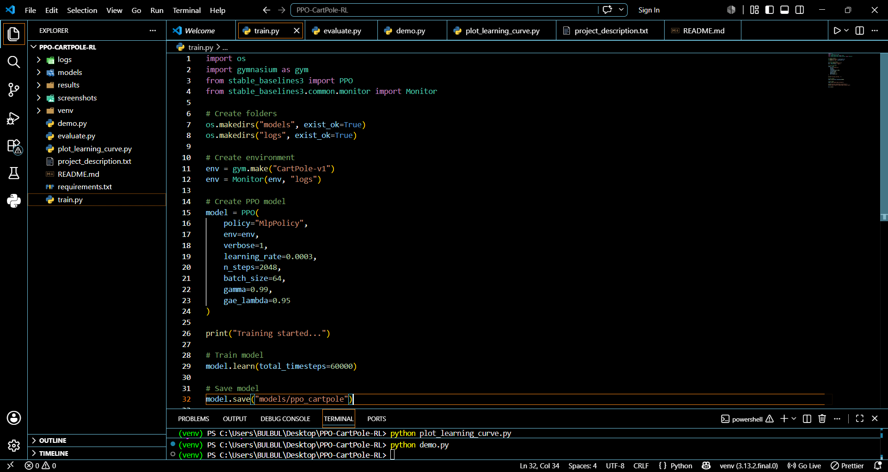
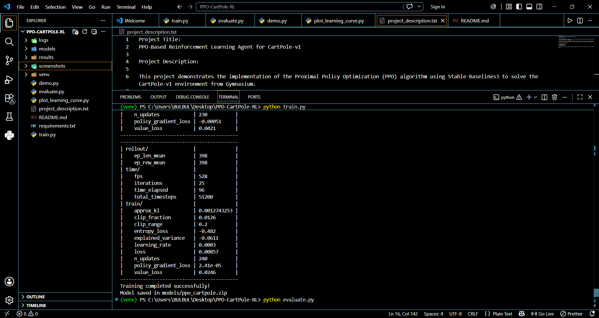
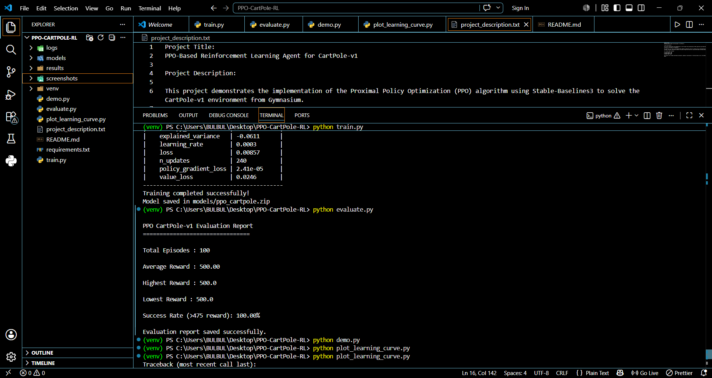
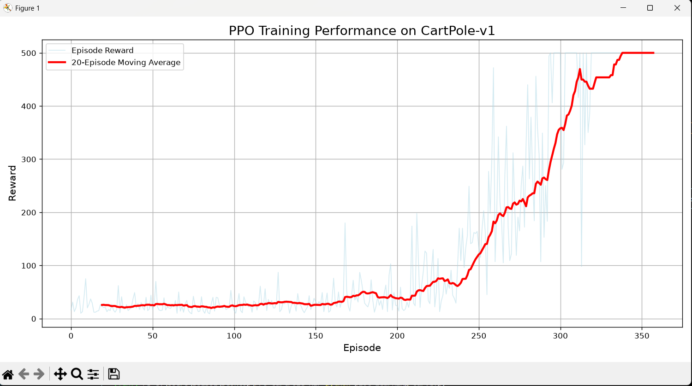
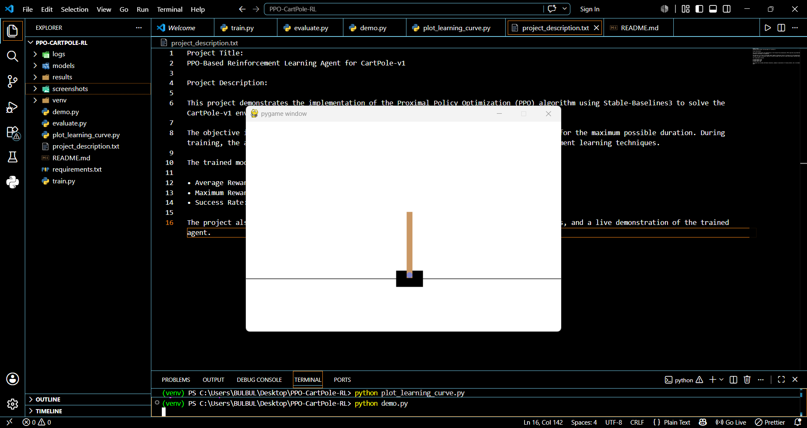

# PPO CartPole-v1 Reinforcement Learning

## Project Overview

This project implements the **Proximal Policy Optimization (PPO)** algorithm using **Stable-Baselines3** to solve the **CartPole-v1** environment from Gymnasium.

The objective is to train an intelligent reinforcement learning agent capable of balancing a pole on a moving cart for the maximum possible duration.

---

## Features

- PPO Reinforcement Learning
- Stable-Baselines3 implementation
- Gymnasium CartPole-v1 environment
- Automatic evaluation
- Training reward visualization
- Live demonstration
- Performance report generation

---

## Project Structure

```
PPO-CartPole-RL
│
├── logs/
├── models/
│   └── ppo_cartpole.zip
├── results/
│   ├── evaluation_report.txt
│   └── learning_curve.png
├── screenshots/
│   ├── project_structure.png
│   ├── training_output.png
│   ├── evaluation_output.png
│   ├── learning_curve.png
│   └── demo_output.png
├── train.py
├── evaluate.py
├── demo.py
├── plot_learning_curve.py
├── requirements.txt
└── README.md
```

---

## Installation

Clone the repository

```bash
git clone https://github.com/Bulbul-chouhan/PPO-CartPole-Reinforcement-Learning.git
```

Install dependencies

```bash
pip install -r requirements.txt
```

---

## Train the Agent

```bash
python train.py
```

---

## Evaluate the Model

```bash
python evaluate.py
```

---

## Run the Demo

```bash
python demo.py
```

---

## Generate Learning Curve

```bash
python plot_learning_curve.py
```

---

# Results

| Metric | Value |
|--------|-------|
| Average Reward | **500.00** |
| Highest Reward | **500** |
| Lowest Reward | **500** |
| Success Rate | **100%** |

---

# Screenshots

## Project Structure



---

## Training Output



---

## Evaluation Output



---

## Learning Curve



---

## Demo



---

## Technologies Used

- Python
- Stable-Baselines3
- Gymnasium
- Reinforcement Learning
- PPO Algorithm
- NumPy
- Pandas
- Matplotlib

---

## Future Improvements

- Train on more complex environments
- Compare PPO with DQN and A2C
- Hyperparameter tuning
- TensorBoard visualization
- Custom RL environments

---

## Author

**Bulbul Chouhan**

Integrated M.Tech Artificial Intelligence

VIT Bhopal University